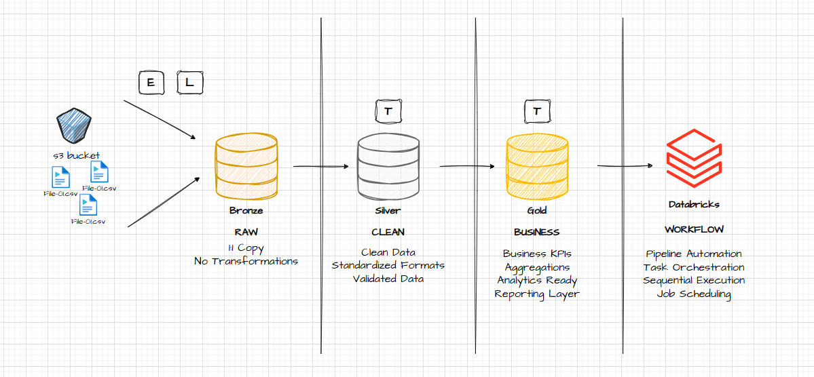
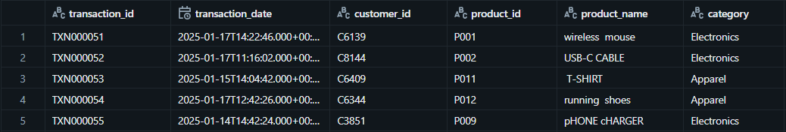
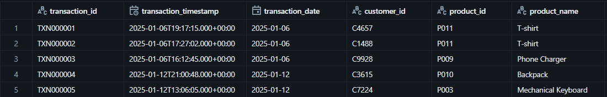
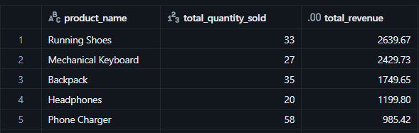
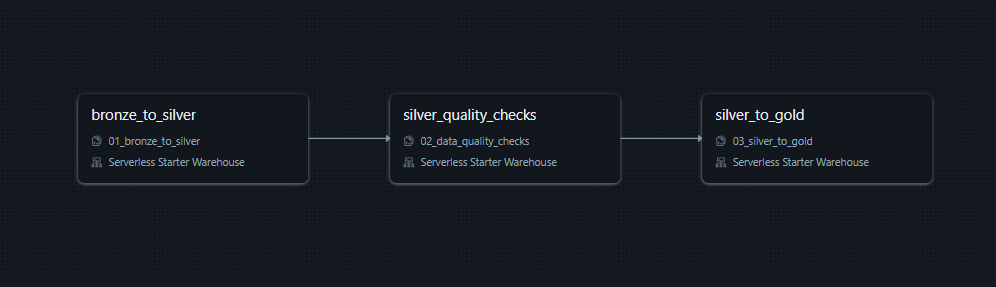

# Databricks Medallion Architecture ETL Pipeline

## Project Overview

Built an end-to-end ETL pipeline in Databricks using Medallion Architecture (Bronze → Silver → Gold).

The project ingests raw transaction data from Amazon S3, performs data cleansing and validation in the Silver layer, and creates business-ready analytical tables in the Gold layer.

The pipeline is orchestrated using Databricks Workflows.

---

# Architecture


---

# Tech Stack

* Databricks
* Databricks SQL
* Delta Lake
* Amazon S3
* Unity Catalog
* Databricks Workflows

---

# Project Structure

```text
transactions/
│
├── 01_bronze_to_silver
├── 02_data_quality_checks
├── 03_silver_to_gold
└── README.md
```

---

# Medallion Layers

## Bronze Layer

* Raw transaction data ingested from S3
* Preserved original source formatting
* Stored as Delta tables

Table:

```text
transactions.bronze.transactions
```



---

## Silver Layer

Performed:

* Timestamp conversion
* Product name standardization
* Whitespace cleanup
* Datatype casting
* Decimal precision handling
* Data quality validation

Table:

```text
transactions.silver.transactions
```


---

# Data Quality Checks

Implemented validations for:

* Null transaction IDs
* Invalid amount calculations
* Invalid quantities
* Invalid pricing values
* Duplicate transaction IDs

---

## Gold Layer

Created business-ready reporting tables.

### sales_by_store

Metrics:

* total transactions
* total sales
* average order value

### product_sales

Metrics:

* quantity sold
* total revenue

Tables:

```text
transactions.gold.sales_by_store
```


```text
transactions.gold.product_sales
```



---

# Workflow Orchestration

```text
Created Databricks Workflow pipeline:
```


The workflow automates transformation and validation tasks sequentially.

---

# Learning Outcomes

* Built Medallion Architecture pipeline
* Implemented ETL transformations using SQL
* Performed data quality validation
* Created Gold layer business aggregations
* Orchestrated workflows in Databricks
* Worked with Delta tables and Unity Catalog

---
